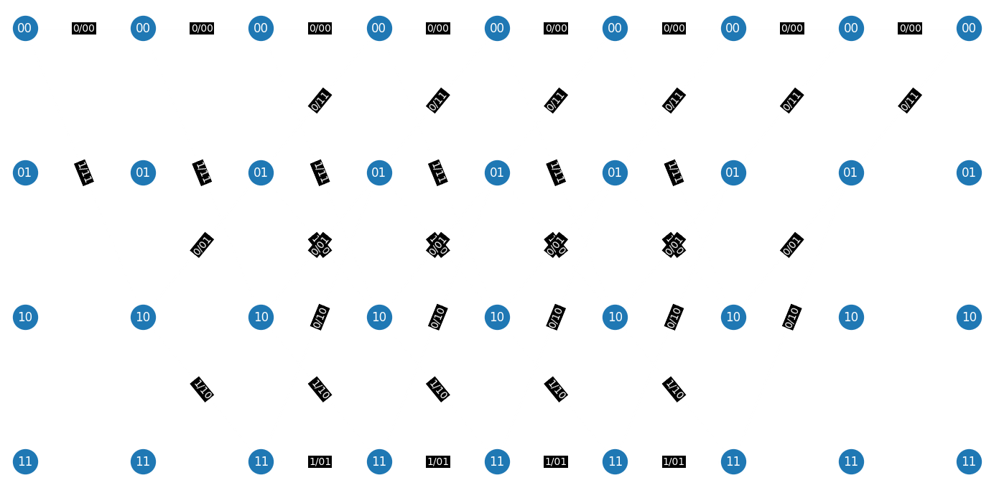

# High-Memory Masked Convolutional Codes

A simple encryption and decryption system using convolutional codes designed to be secure even against quantum computers.

## Overview

This project implements an encryption system that uses convolutional codes with **extra memory** (called high-memory). These codes are combined with random masking and permutations to create strong and flexible encryption.

### Main Components:

- **Custom Generator Matrix**: Built from convolutional code polynomials
- **Random Permutation & Masking**: Increases security
- **Trellis Diagram & Viterbi Decoding**: Used to decode encrypted messages

## Features

- ✅ Works for messages of length 6
- 🔁 Adds random errors to simulate real-world noise
- 🔐 Uses two layers of polynomials to hide message bits
- 🎯 Decodes using minimal Hamming distance path through a trellis
- 🧠 Supports Viterbi-style decoding to recover the message

## Files

### `code_based_cryptosystem.py`

Main logic for encryption and decryption.

- **Generator Matrix (Gp & Gpq)**: Built from simple and high-memory convolutional polynomials
- **Encrypt**: Encodes the message using `Gpq`, adds random errors, and applies a permutation
- **Decrypt**: Uses inverse permutation, polynomial division, and bit-masking to recover possible decoded candidates
- **Trellis Path Search**: Tries different decoded candidates and finds the best one using minimal Hamming distance
- **Visualization**: Plots the trellis diagram for visual understanding

Run the `main()` function to see the full process in action.

### `trellis.py`

Generates and visualizes a **trellis diagram** based on convolutional code parameters.

- **Nodes and Connections**: Represent encoder states and transitions
- **Edge Labels**: Show input bit and output bits (difference from expected bits)
- **Visualization**: Uses NetworkX and Matplotlib to draw the trellis

- Solid edges = input bit `0`  
- Dashed edges = input bit `1`

### Example Trellis Output
Trellis created with  
**p₀ = 1 + x²**,  
**p₁ = 1 + x + x²**,  
**K = 3**, and  
**Input length = 6**.

