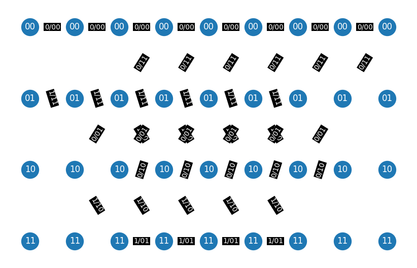

# High-Memory Masked Convolutional Codes

A post-quantum cryptography implementation based on convolutional codes.

## Overview

This project implements a novel post-quantum encryption scheme using high-memory masked convolutional codes. Unlike traditional code-based methods that rely on block codes with fixed parameters, this approach:

- Supports arbitrary plaintext lengths
- Uses convolutional codes with strong error-correction capabilities
- Employs a dual-layer error mechanism for enhanced security
- Scales efficiently with linear decryption complexity

## Features

- **Stronger Security**: Offers significantly enhanced cryptanalytic resistance compared to Classic McEliece
- **Flexible Code Selection**: Supports various convolutional codes to meet specific security needs
- **Scalable Key Length**: Adaptable to different security requirements
- **Efficient Hardware Implementation**: Uses the Viterbi algorithm for decoding

## `trellis.py`

The `trellis.py` file generates and visualizes a **trellis diagram** for convolutional encoders based on two generator polynomials. It simulates how the encoder transitions between states and produces outputs for each input bit.

- You can customize the encoder by changing the polynomials and input length.
- The trellis is drawn using NetworkX and Matplotlib.
- Solid edges represent input bit `0`, dashed edges represent input bit `1`.

### Example Trellis Output
The image below presents the trellis diagram for the generator polynomials  
**g₀ = 1 + x + x²** and **g₁ = 1 + x²**, with **K = 3** and input message length **6**.

